### 05虚拟机栈

由于跨平台性的设计，Java的指令都是根据栈来设计的。不同平台CPU架
构不同，所以不能设计为基于寄存器的。
**优点是跨平台，指令集小，编译器容易实现，缺点是性能下降，实现同样**
**的功能需要更多的指令。**

 有不少Java开发人员一*提到Java内存结构，就会非常粗粒度地将JVM中的内存区理解为仅有Java堆(heap)和Java栈(stack)?为什么?

 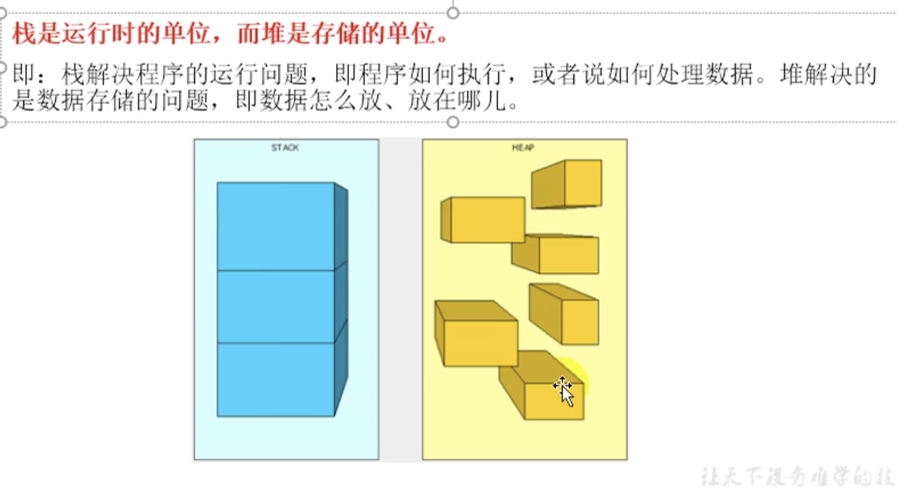

堆，来解决数据的存储问题，主体的数据都在堆中放，当然也不是全部，对象呢主要是在堆中放的。**那如果你要是方法内的一些局部变量的话，是放在栈中，当然这变量是基本数据类型。引用数据类型的话呢，在栈空间只是放这个对象的一个引用只要是对象，都是在堆空间**。所以主体上数据都放在堆空间，栈空间它也是可以放一些数据的，局部变量的一些基本类型的数据或者引用的对象的一个地址，也是放在这个栈中。堆的大小可以设置，方法区因为是本地物理内存，最大，堆第二。

**Java虚批机桟是什么?**
Java虚似机栈(Java Virtual Machine Stack) ，早期也叫Java栈。
毎个线程在创建吋都会创建一个虚拟机栈，其内部保存一个个的栈帧(stack Frame) ，对应着一次次的Java方法凋用。

**是线程私有的**

**生命周期**
生命周期和线程一致。
**作用**
主管Java程序的运行，它保存方法的局部变量（8种基本数据类型、对象的引用地址）、部分结果，并参与方法的调用和返回。

- 局部变量 VS 成员变量（或属性）
- 基本数据变量 VS 引用类型变量（类、数组、接口）


栈顶顶方法叫做当前方法

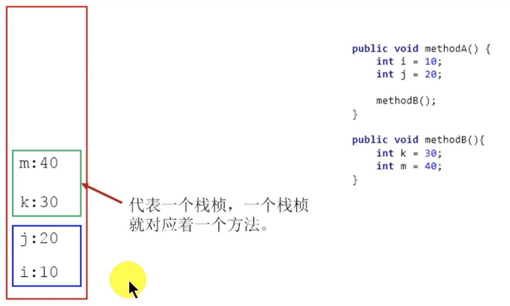

栈的特点(优点)
●栈是一种快速有效的分配存储方式，访问速度仅次于程序计数器。
●JVM直接对Java栈的操作只有两个:
➢每个方法执行，伴随着进栈(入栈、压栈)
➢执行结束后的出栈工作
●对于栈来说不存在垃圾回收问题

​	栈存在OOM，不存在GC （因为只有进栈出栈的操作）

程序计数器不存在GC,也不存在OOM，因为它只存一个地址


面试中：开发中遇到的异常有哪些？
栈中可能出现的异常
●Java虚拟机规范允许**Java栈的大小是动态的或者是固定不变的。**
➢如果采用固定大小的Java虚拟机栈，那每一个线程的Java虛拟机栈容量可以在线程创建的时候独立选定。如果**线程请求分配**的栈容量超过Java虚拟机栈允许的最大容量，Java 虚拟机将会抛出一个**StackOverflowError**异常。
➢如果Java虚拟机栈可以动态扩展，并且在尝试扩展的时候无法申请到足够的存，或者在创建新的**线程时没有足够的内存**去创建对应的虚拟机栈,那Java虚拟机将会抛出一个**OutofMemoryError**异常。

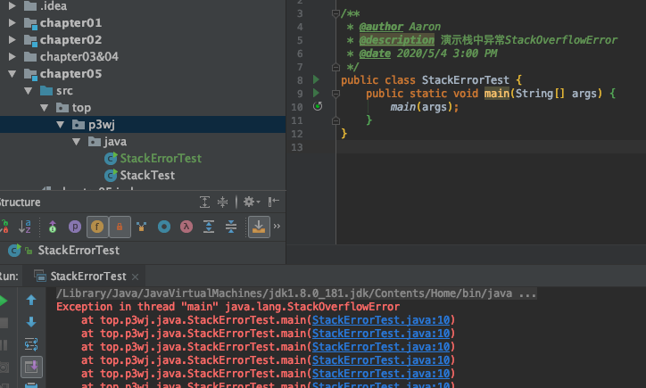

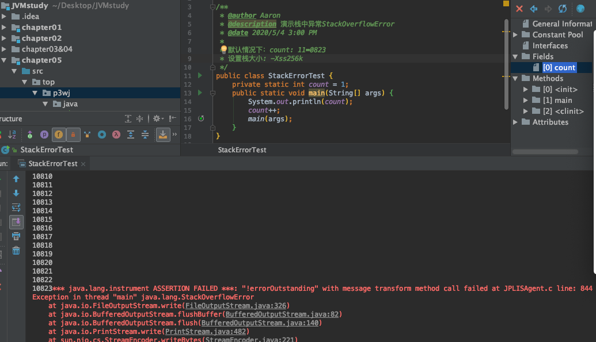

**现改变栈大小**

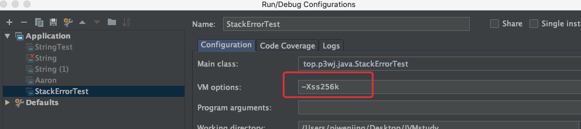

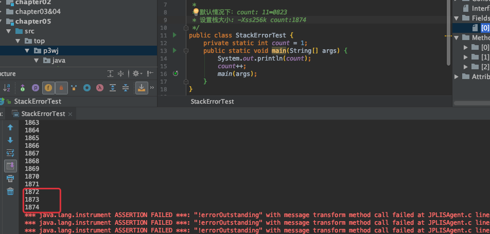

不同操作系统会有所不同

### 栈的存储单位

栈中存储什么?
●每个线程都有自己的栈栈中的数据都是以**栈帧(Stack Frame)的格式存在。**
● 在这个线程上正在执行的每个方法都各自对应一个栈帧(Stack Frame) 。
●栈帧是一个内存区块，是一个数据集，维系着方法执行过程中的各种数据信息。

复习：

- OOP的基本概念：类、对象
- 类中基本结构：field（属性、字段、域）、method

●JVM直接对Java栈的操作只有两个，就是对栈帧的**压栈**和**出栈**，遵循“先进后出”/“后进先出”原则。
●在一条活动线程中，一个时间点上，只会有一个活动的栈帧。即只有当前正
在执行的方法的栈帧(栈项栈帧)是有效的，这个栈帧被称为当前栈帧(Current Frame) ，与当前栈帧相对应的方法就是当前方法(Current Method)，定义这个方法的类就是当前类(Current Class)
●执行引擎运行的所有字节码指令只针对当前栈帧进行操作。
●如果在该方法中调用了其他方法，对应的新的栈帧会被创建出来，放在栈的
顶端，成为新的当前帧。

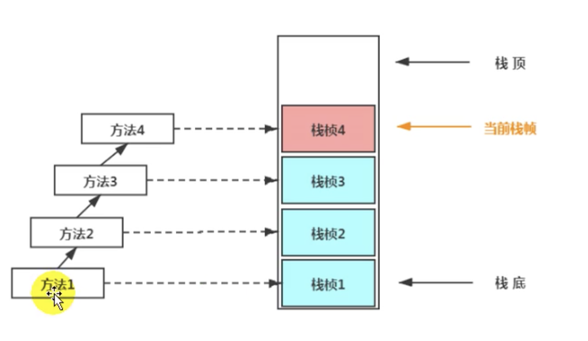

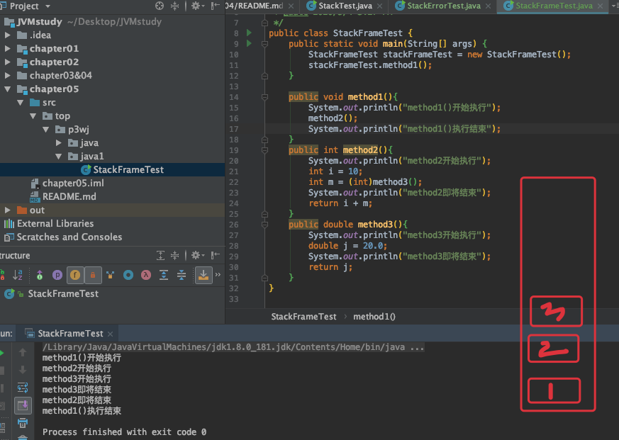

**debug**来看一下

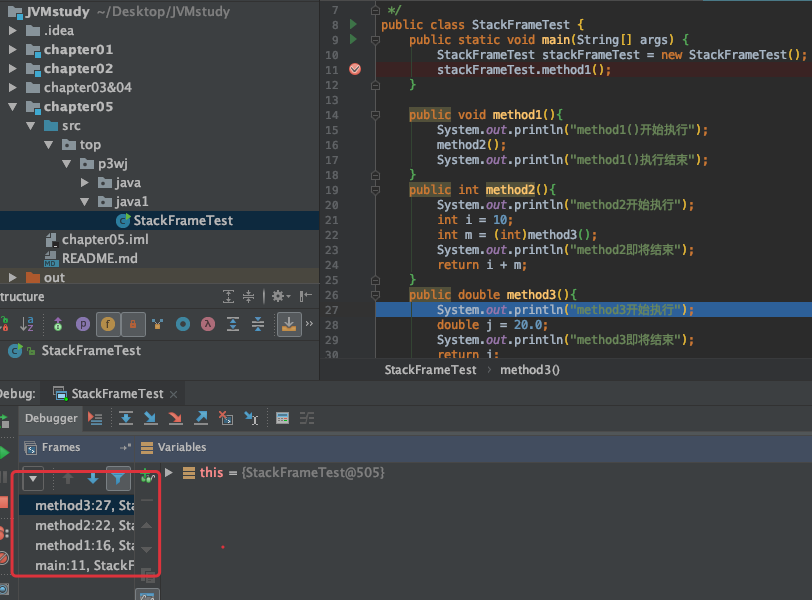

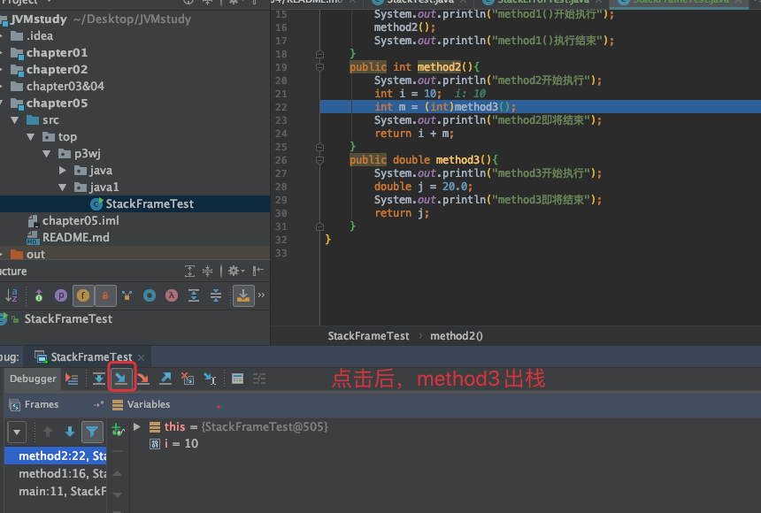

●不同线程 中所包含的栈帧是不允许存在相互引用的，即不可能在一个栈帧之，中引用另外一个线程的栈帧。

●如果当前方法调用了其他方法，方法返回之际，当前栈帧会传回此方法的执行果
给前一个栈帧，接着，虚拟机会丢弃当前栈帧，使得前一个栈帧重新成为当前帧。

●Java方法有两种返回函数的方式，**一种是正常的函数返回，使用return指令;另外一种是抛出异常（没有处理的异常）。不管使用哪种方式，都会导致栈帧被弹出。**

**例3抛2->1**

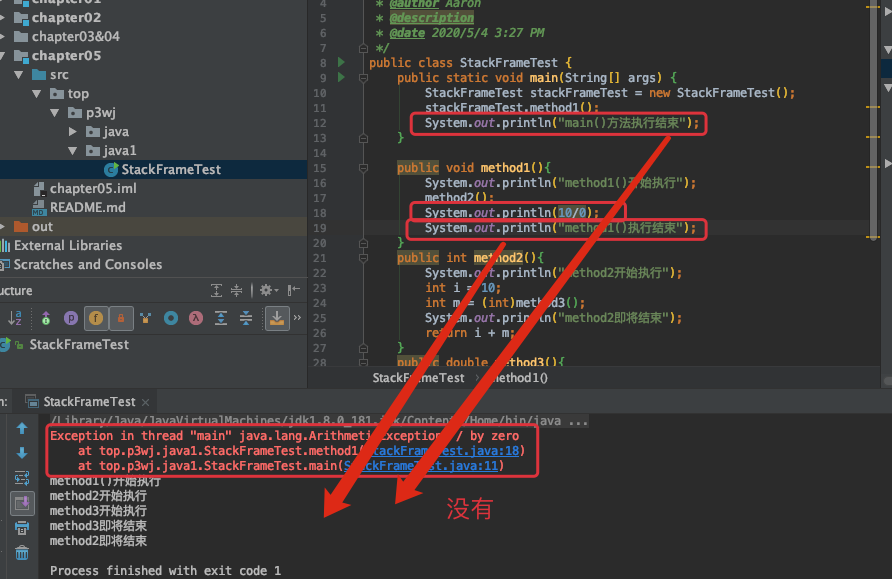

由上可知method1跟main都是异常出错。没有进行捕获

1. method1处捕获

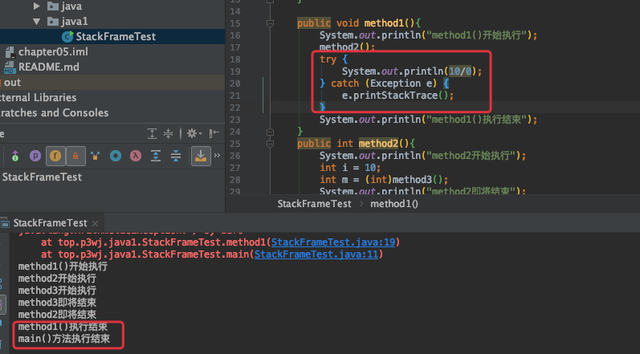

2.main处捕获

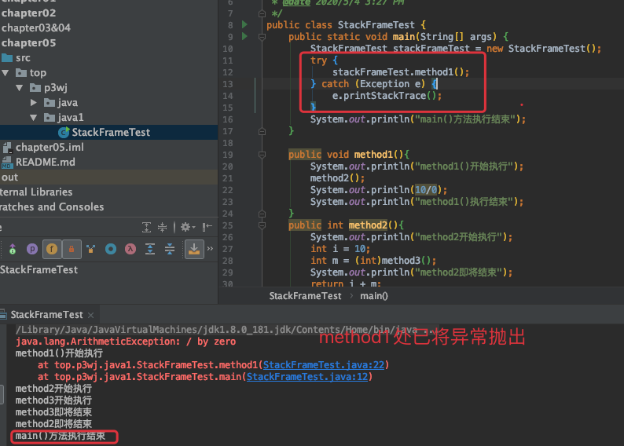

此时main是以正常方式结束的，method1不是

**再来看一下返回值**

```
public double method3(){
    System.out.println("method3开始执行");
    double j = 20.0;
    System.out.println("method3即将结束");
    return j;
}
```

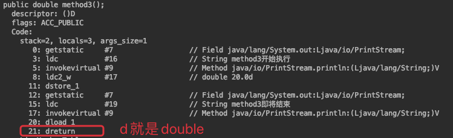

```
public int method2(){
    System.out.println("method2开始执行");
    int i = 10;
    int m = (int)method3();
    System.out.println("method2即将结束");
    return i + m;
}
```

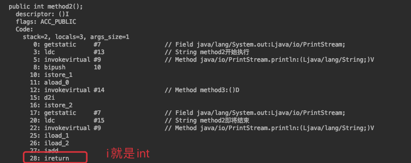

```
    public void method1(){
        System.out.println("method1()开始执行");
        method2();
//        System.out.println(10/0);
        System.out.println("method1()执行结束");
    }
```

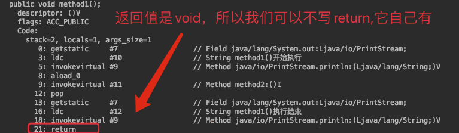

**栈帧的内部结构**

毎个栈帧中存储着:

- **局部变量表(Local variables)**
- **操作数栈(operand stack) (或表达式栈)**
- 动态链接(Dynamic Linking) ( 或指向运行吋常量池的方法引用)
- 方法返回地址(Return Address) (或方法正常退出或者异常退出的定义)一些附加信息

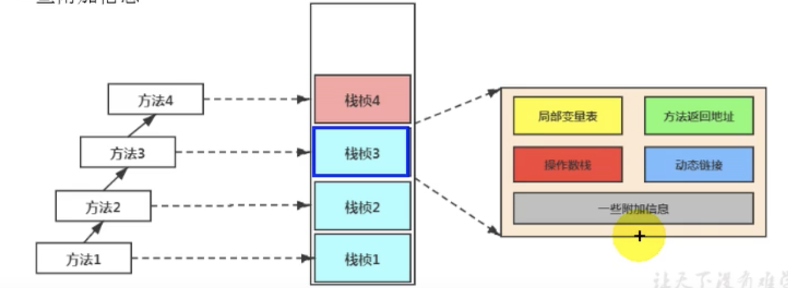

栈帧的大小取决于内部结构的大小

**多个线程时**

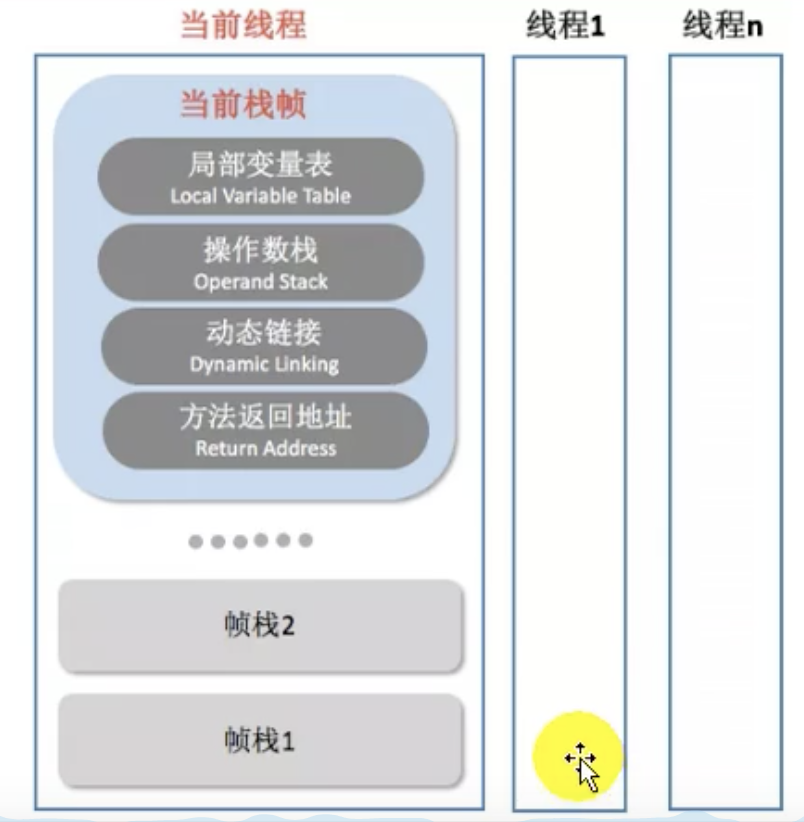

**局部变量表**

- 局部变量表也被称之为局部变量数组或本地变量表
- **定义为一个数字数组，主要用于存储方法参数和定义在方法体内的局部变量**，这些数据类型包括各类基本数据类型、对象引用(reference) ，以returnAddress类型。
- 由于局部变量表是建立在线程的栈上，是线程的私有数据，因此**不存在数据安全问题**
- **局部变量表所需的容量大小是在编译期确定下来的**，并保存在方法的Code属性的maximum local variables数据项中。在方法运行期间是不会改变局部变量表的大小的。

**对大小在编译期确定下来的做一个验证**

Javap 相当于对字节码文件的一个解析

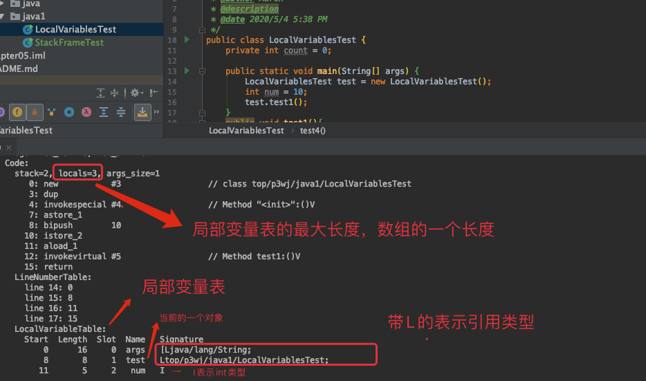


字节码从上往下的一个格式

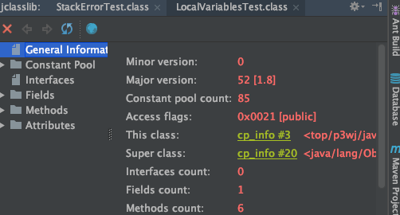

**现在解释一下结构**

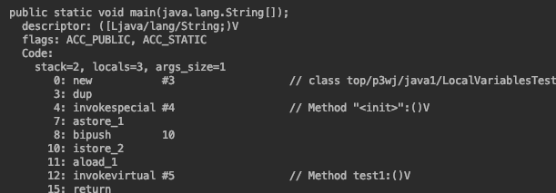

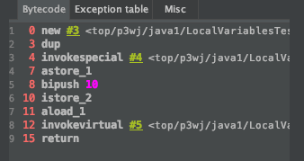

Bytecode是字节码，与上图相对应

Exception table异常表，没有就是空的

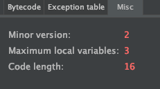

Maximum local variables:最大局部变量表长度

所以是编译期确定的，在运行时不会改变

Code length: 方法执行的一个长度(指的是字节码)


- **方法嵌套调用的次数由栈的大小决定。**一般来说，**栈越大，方法嵌套调用次**
  **数越多。**对一个函数而言，它的参数和局部变量越多，使得局部变量表膨胀,
  它的栈帧就越大，以满足方法调用所需传递的信息增大的需求。进而函数调
  用就会占用更多的栈空间，导致其嵌套调用次数就会减少。
- **局部变量表中的变量只在当前方法调用中有效**。在方法执行时，虚拟机通过
  使用局部变量表完成参数值到参数变量列表的传递过程**。当方法调用结束后，**
  **随着方法栈帧的销毁，局部变量表也会随之销毁。**


- 参数值的存放总是在局部变量数组的index0开始，到数组长度-1的索引结束。
  局部变量表，最基本的存储单元是Slot (变量槽)
- 局部变量表中存放编译期可知的各种基本数据类型(8种)，引用类(reference)，returnAddress类型。

- 在局部变量表里，32位以内的类型只占用一个slot (包括returnAddress型)，64位的类型(long和dquble)占用两个slot。
  ➢byte 、short 、char在存储前被转换为int，boolean 也被转换为int，0表示false，非0表示true。
  ➢long和double则占据两个Slot（变量槽）。

现对**jclasslib**做一个说明

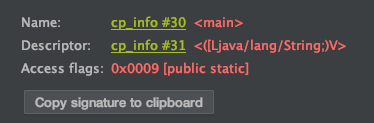

Name：名称

Descriptor:方法的参数。String类型的一维数组，V是void类型

Access flags:访问标识

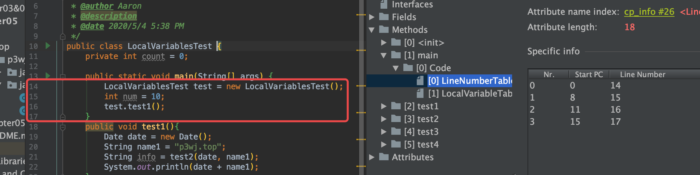

**行号表**

Line Number java 代码的行号

Start PC 字节码指令的行号

以Line Number=15为例

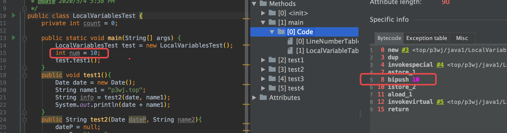

**局部变量表**

按照声明的先后顺序，依次生成局部变量表的索引位置

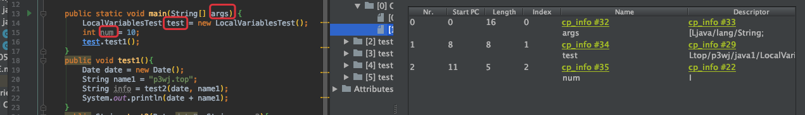

Start PC，表明了该变量作用域的一个起始位置

声明之后，作用域从下一行开始

Length是长度（偏移）。会发现0+16=8+8=11+5=16都是为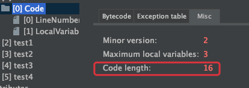

**代码长度**

即作用域为括号内，括号里面长度为16，出了作用域就失效。

如hello为（2，5）就是ello,后面就没了

**关于Slot的理解**

●参数值的存放总是在局部变量数组的index0开始，到数组长度-1的索引结束。局部变量表，**最基本的存储单元是Slot (变量槽)**
● 局部变量表中存放编译期可知的各种基本数据类型(8种)，引用类型(reference)，returnAddress类型的变量。
在局部变量表里，**32位以内的类型只占用一个slot (包括returnAddress类型)，64位的类型(long和double)占用两个slot。**
➢byte、short 、char在存储前被转换为int，boolean 也被转换为int，0表示false ，非0表示true。
➢long 和double 则占据两个Slot。

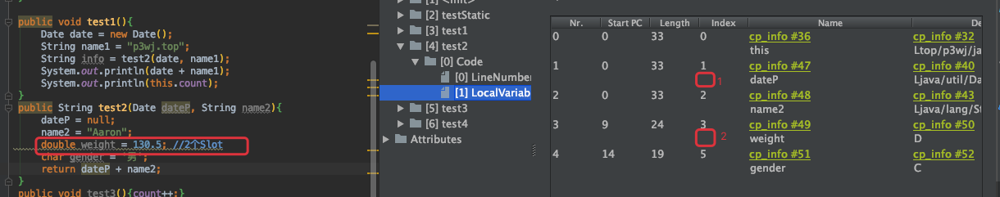


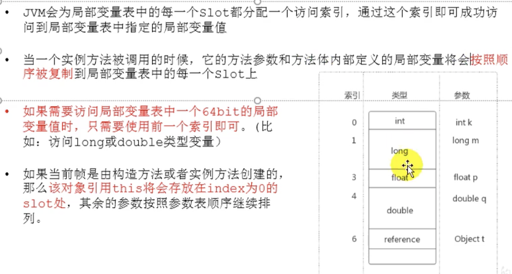

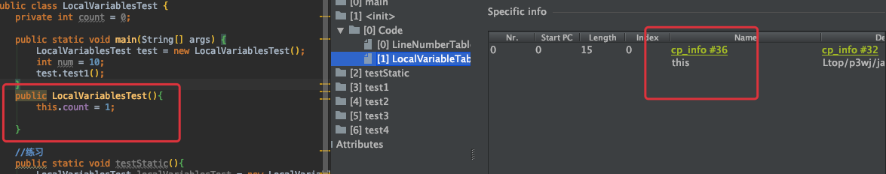

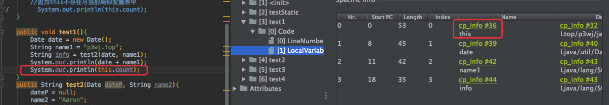

没有调用this局部变量表中也有

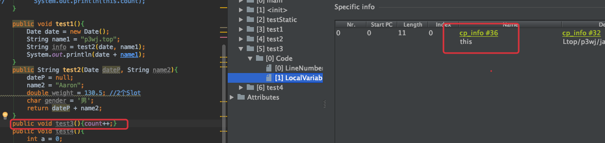

静态代码块中不允许用this

因为this不存在与当前局部变量表中

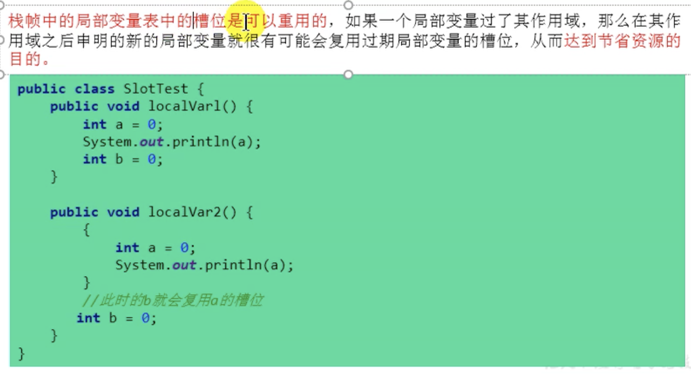

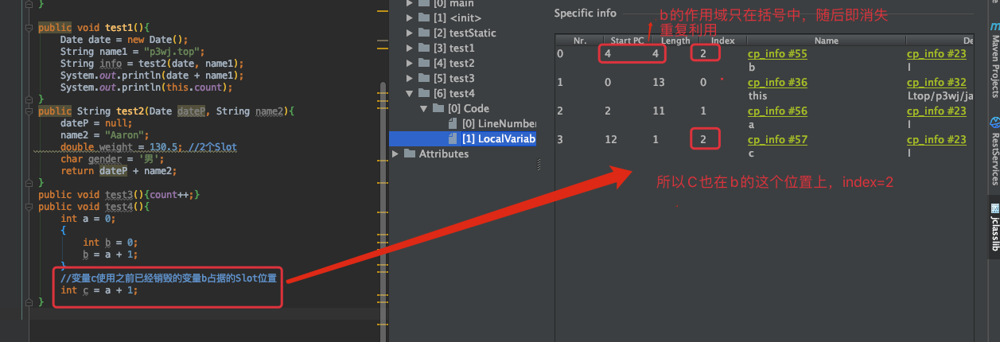

**举例**：**静态变量与局部变量的对比**

变量的分类：

按照数据类型分：1、基本数据类型	2、引用数据类型

按照在类中声明的位置分：

1、成员变量：在使用前，都经历过默认初始化赋值

1.1类变量：linking的prepare阶段：给类变量默认赋值 ---> initial阶段：给类变量显式赋值即静态代码块赋值

1.2实例变量：随着对象的创建、会在空间中分配实例变量空间，并进行默认赋值

2、局部变量：在使用前，必须要进行显式赋值，否则编译不通过

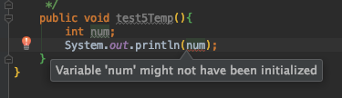

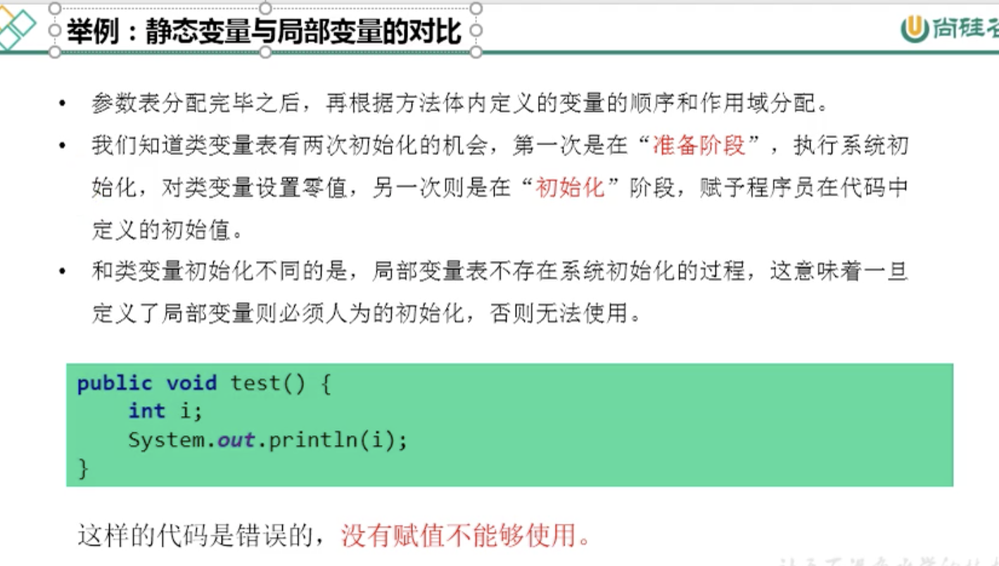

**补充说明**
●在栈帧中，与性能调优关系最为密切的部分就是前面提到的局部变量表。
在方法执行时，虚拟机使用局部变量表完成方法的传递。
**●局部变量表中的变量也是重要的垃圾回收根节点，只要被局部变量表中直**
**接或间接引用的对象都不会被回收。**

栈是管运行的

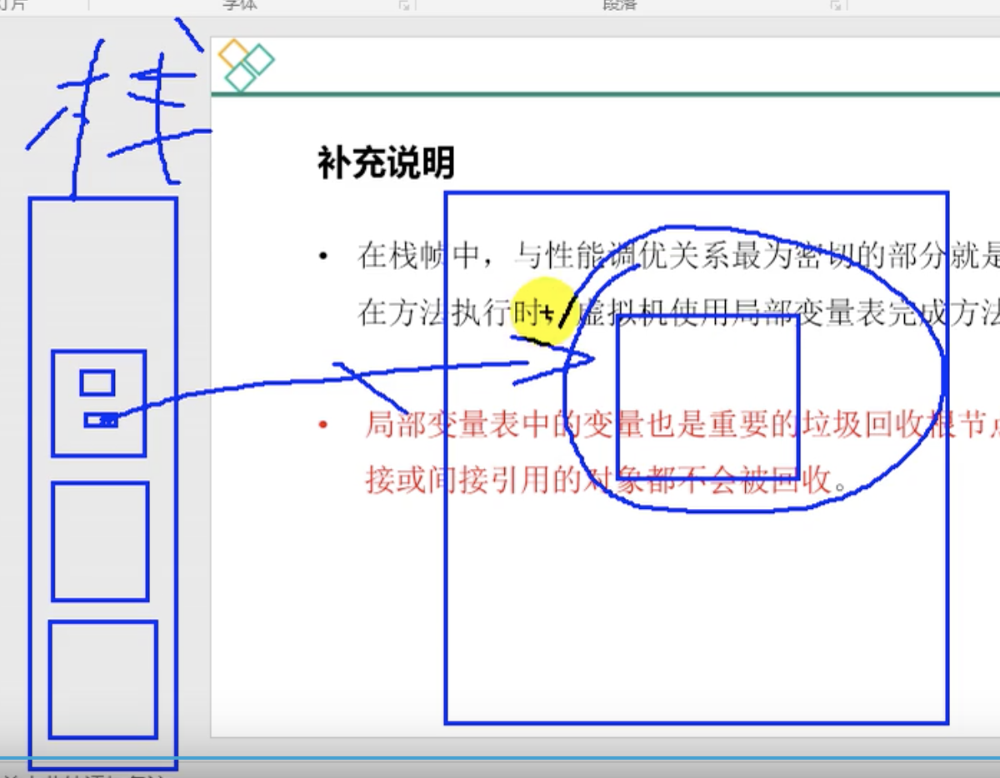

局部变量表存储的数据需要load加载，sotre等都会影响到堆中的gc。对gc影响较大的就是栈中的局部变量表，

### 操作数栈

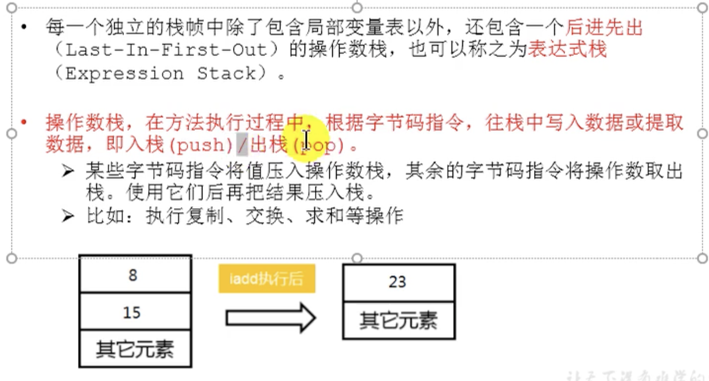

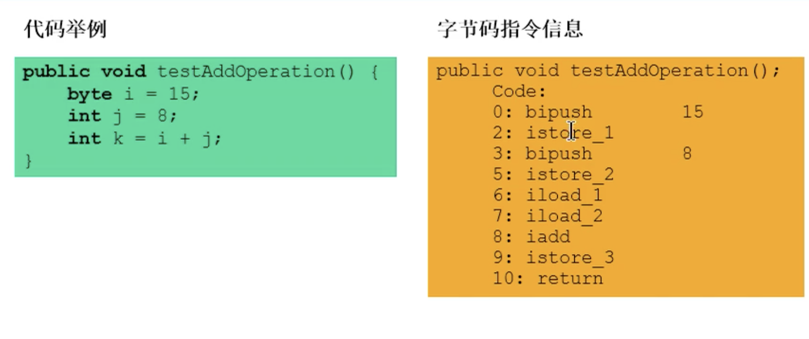

-----------------------------------------------------
●操作数栈，**主要用于保存计算过程的中间结果，同时作为计算过程中变量**
**临时的存储空间。**

●操作数栈就是JVM执行引擎的一一个工作区，当一个方法刚开始执行的时候，
一个新的栈帧也会随之被创建出来，**这个方法的操作数栈是空的。**

●每一个操作数栈都会拥有一个明确的栈深度用于存储数值，其所需的最大
深度在编译期就定义好了，保存在方法的Code属性中，为max_ stack的
值。

●栈中的任何一个元素都是可以任意的Java数据类型。
➢32bit的类型占用一个栈单位深度
➢64bit的类型占用两个栈单位深度

●操作数栈**并非采用访问索引的方式来进行数据访问**的，而是只能通过标准
的入栈(push) 和出栈(pop)操作来完成一次数据访 问。

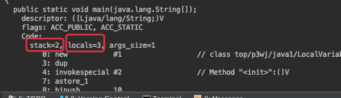

locals：局部变量表深度

stack: 操作数栈的深度

●**如果被调用的方法带有返回值的话，其返回值将会被压入当前栈帧的操作数栈中**，并更新PC寄存器中下一条需要执行的字节码指令。

●操作数栈中元素的数据类型必须与字节码指令的序列严格匹配，这由编译器在编译器期间进行验证，同时在类加载过程中的类检验阶段的数据流分析阶段要再次验证。

●另外，我们说Java虚拟机的**解释引擎是基于栈的执行引擎**，其中的栈指的
就是操作数栈。

### 代码追踪

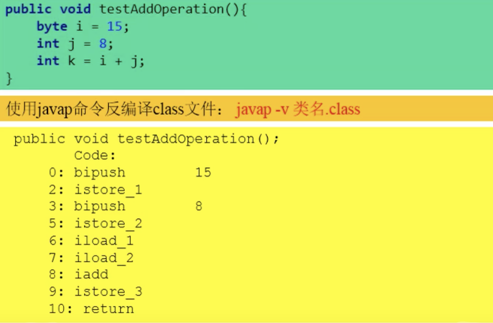

**一**、

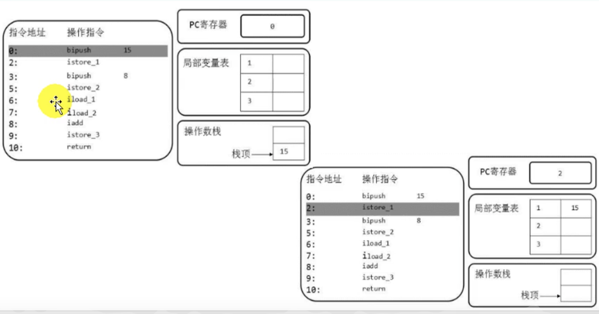

**二**、

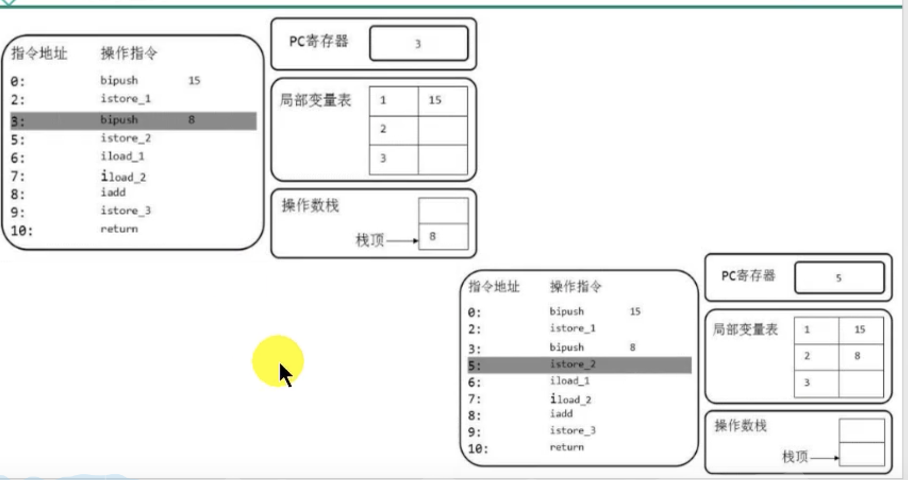

**三**、

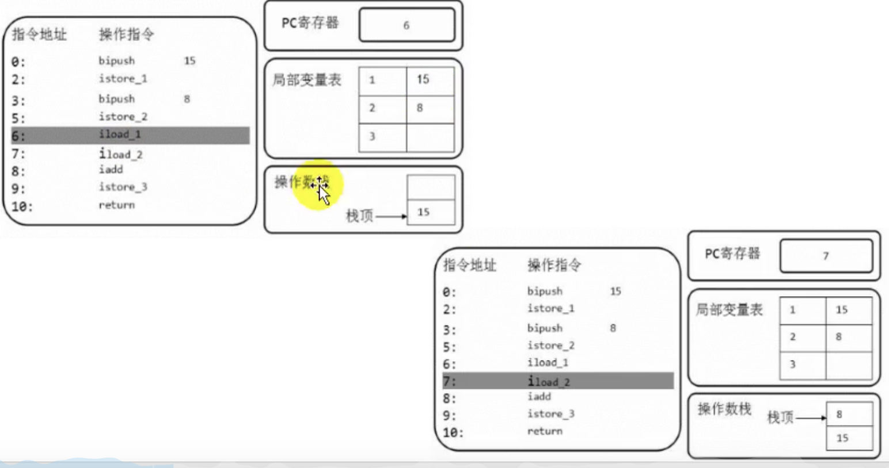

**四**、

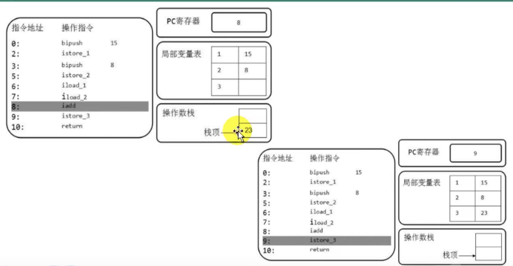

由上可知操作数栈深度为2

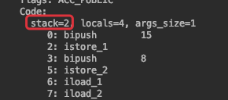


**8在byte范围内，一个字节可以表示**

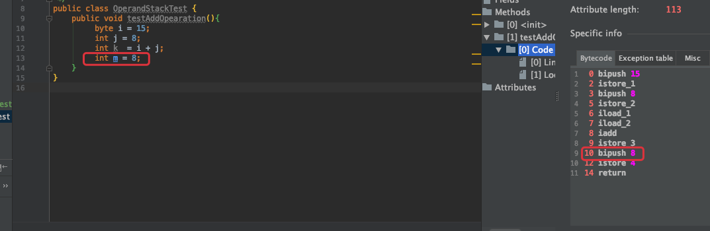

**800即为short**

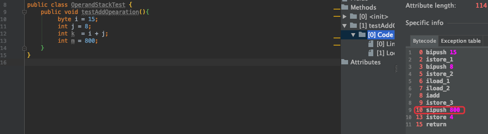

**超过int,编译就会报错**

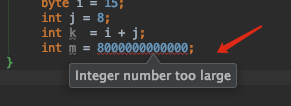


load_0 就是把一个对象引用加载到局部变量表，而刚好这个对象是this因为getSum()方法就是this对象的


### 动态链接

栈帧内部结构


**帧数据区**：一些附加信息，动态链接，方法返回地址

### 动态链接（或指向运行时常量池的方法引用）

●每一个栈帧内部都包含一个指向**运行时常量池中该栈帧所属方法的引用。**包含这个引用的目的就是为了支持当前方法的代码能够实现**动态链接(Dynamic Linking)** 。比如: invokedynamic指 令
●在Java源文件被编译到字节码文件中时，所有的变量和方法引用都作为符号引用(symbolic Reference) 保存在class文件的常量池里。比如:描述一个方法调用了另外的其他方法时，就是通过常量池中指向方法的符号引用来表示的，那么**动态链接的作用就是为了将这些符号引用转换为调用方法的直接引用。**

大部分字节码指令在执行时都会进行常量池的访问


**Constant pool常量池在运行时期存到方法区（运行时常量池）** 

通过引用去调用，几份一起调用对应地址都一样，不然浪费

比如多态，编写的父类，运行的子类

为什么需要常量池呢?
常量池的作用，就是为了提供一些符号和常量，便于指令的识别。

### 方法的调用

在JVM中，将符号引用转换为调用方法的直接引用与方法的绑定机制相关（**在编译期间确定还是运行期间确定**）。
**●静态链接:**
当一个字节码文件被装载进JVM内部时，如果被调用的**目标方法在编译期可知**，
且运行期保持不变时。这种情况下将调用方法的符号引用转换为直接引用的
过程称之为静态链接。

**●动态链接:**
如果**被调用的方法在编译期无法被确定下来**，也就是说，只能够在程序运行
期将调用方法的符号引用转换为直接引用，由于这种引用转换过程具备动态
性，因此也就被称之为动态链接。

对应的方法的绑定机制为:早期绑定(Early Binding) 和晚期绑定.
(Late Binding) 。**绑定是一个字段、方法或者类在符号引用被替换为直接引用的过程，这仅仅发生一次。**
**●早期绑定:**
早期绑定就是指被调用的**目标方法如果在编译期可知，且运行期保持不变**时，即可将这个方法与所属的类型进行绑定，这样一来，由于明确了被调用的目。标方法究竟是哪--个，因此也就可以使用静态链接的方式将符号引用转换为直接引用。
**●晚期绑定:**
如果**被调用的方法在编译期无法被确定下来，只能够在程序运行期根据实际**
**的类型绑定相关的方法**，这种绑定方式也就被称之为晚期绑定。


Invoke virtual虚调用指令


Invoke special早期绑定

如

[早期晚期绑定](https://blog.csdn.net/u012813201/article/details/76850625)

随着高级语言的横空出世，I类似于Java-样的基于面向对象的编程语言如今
越来越多，尽管这类编程语言在语法风格.上存在一定的差别，但是它们彼此
之间始终保持着一个共性，那就是都支持封装、继承和多态等面向对象特性, .
既然这**一类的编程语言具备多态特性，那么自然也就具备早期绑定和晚期绑**
**定两种绑定方式。**

Java中任何一个普通的方法其实都具备虚函数的特征，它们相当于C++语言
中的虛函数(C+ +中则需要使用关键字virtual来显式定义)。如果在Java
程序中不希望某个方法拥有虛函数的特征时，则可以使用关键字final来标
记这个方法。

final就是不能被重写了，在编译期就确定了。

非虚方法:
●如果方法在编译期就确定了具体的调用版本，这个版本在运行时是不可变的。
这样的方法称为**非虚方法**。

●（**静态方法、私有方法、final方法）【不能重写】、**（实例构造器 、父类方法都是非虚方法）【例如通过this.调用，都是一个确定的方法】。

●其他方法称为虚方法。

子类对象的多态性的使用前提：1.类的继承关系。2.方法的重写

虚拟机中提供了以下几条方法调用指令:
**普通调用指令:**（1、2非虚方法）

1. **invokestatic: 调用静态方法，解析阶段确定唯一方法版本**

2. **invokespecial: 调用<init>方法、私有及父类方法，解析阶段确定唯一方法版本**

3. invokevirtual: 调用所有虚方法

4. invokeinterface: 调用接口方法

  **动态调用指令:**

5. invokedynamic: 动态解析出需要调用的方法，然后执行（JDK7新增）

  前四条指令固化在虚拟机内部，方法的调用执行不可人为干预，而invokedynamic指令则支持由用户确定方法版本。其中**invokestatic指令和invokespecial指令调用的方法称为非虚方法，其余的(final修饰的除外)称为虚方法。**

[关于static](https://blog.csdn.net/ZhangWangYang/article/details/51319131)

[静态方法不能用this与super](https://www.cnblogs.com/guweiwei/p/6978814.html)

  ```java
  
  class Father{
      public Father(){
          System.out.println("father的构造器");
      }
      public static void showStatic(String str){
          System.out.println("father "+ str);
      }
      public final void showFinal(){
          System.out.println("father show final");
      }
      public void showCommon(){
          System.out.println("father 普通方法");
      }
  
  }
  public class Son extends Father{
      public Son(){
          //invokespecial
          super();
      }
      public Son(int age){
          //invokespecial
          this();
      }
      //不是重写的父类的静态方法，因为静态方法不能被重写
      public static void showStatic(String str){
          System.out.println("son "+ str);
      }
      public void showPrivate(String str){
          System.out.println("son private "+str);
      }
      public void show(){
          //invokestatic
          showStatic("p3wj.top");
          //invokestatic
          Father.showStatic("good!");
          //invokespecial
          showPrivate("hello!");
          //invokespecial
          super.showCommon();
          //虚方法：编译期间无法确定下来的
          //invokevirtual,虽然是这个但是被final修饰他不是一个虚方法
          showFinal();
  
          //invokespecial，加上super,显示地表示是一个父类地方法
          super.showFinal();
          //invokevirtural,因为有可能该子类会重写这方法，如果加上super就是invokespecial
          showCommon();
          info();
  
          MethodInterface in = null;
          //invokeinterface
          in.methodA();
  
      }
      public void info(){
  
      }
      public void display(Father f){
          f.showCommon();
      }
  
      public static void main(String[] args) {
          Son so = new Son();
          so.show();
      }
  }
  interface MethodInterface{
      void methodA();
  }
  ```


**方法的调用：关于invokedynamic指令**

●JVM字节码指令集一直比较稳定，一直到Java7中才增加了一个invokedynamic指令，**这是Java为了实现「动态类型语言」支持而做的一种改进。**

●但是在Java7中并没有提供直接生成invokedynamic指令的方法，需要借助ASM这种底层字节码工具来产生invokedynamic指令。**直到Java8的Lambda表达式的出现，invokedynamic指 令的生成，在Java中才有 了直接的生成方式。**

●Java7中增加的动态语言类型支持的本质是对Java虚拟机规范的修改，而不是对Java语言规则的修改，这一块相对来讲比较复杂，增加了虚拟机中的方法调用，最直接的受益者就是运行在Java平台的动态语言的编译器。

**动态类型语言和静态类型语言。**

动态类型语言和静态类型语言两者的区别就在于对类型的检查是在编译期还
是在运行期，满足前者就是静态类型语言，反之是动态类型语言。

说的再直白一-点就是，**静态类型语言是判断变量自身的类型信息;动态类型语言是判断变量值的类型信息，变量没有类型信息，变量值才有类型信息**，这是动态语言的一个重要特征。

```
Java: String info = "atguigu"; / /info = atguigu;
JS: varname = "shkstart"; var name = 10 ;
Python:info = 130. 5;
```


### 方法的调用：方法重写的本质

**Java语言中方法重写的本质:**
1.找到操作数栈顶的第一个元素所执行的对象的实际类型，记作C。

2.如果在类型C中找到与常量中的描述符合简单名称都相符的方法，则进行访问权限校验，如果通过则返回这个方法的直接引用，查找过程结束;如果不通过，则返回java. lang. IllegalAccessError异常。

3.否则，按照继承关系从下往上依次对C的各个父类进行第2步的搜索和验证过程。

4.如果始终没有找到合适的方法，则抛出java. lang . AbstractMethodError异常。

**IllegalAccessError介绍:**
程序试图访问或修改一个属性或调用一个方法，这个属性或方法，你没有权限访问。一般的，这个会引起编译器异常。这个错误如果发生在运行时，就说明一个类发生了不兼容的改变。

### 方法的调用：虚方法表

●在面向对象的编程中，会很频繁的使用到动态分派，如果在每次动态分派的过程中都要重新在类的方法元数据中搜索合适的目标的话就可能影响到执行效率。因此，**为了提高性能**，JVM采用在类的方法区建立一个虚方法表
**(virtual method table) (非虛方法不会出现在表中)来实现。使用索引表来代替查找。**

●每个类中都有一一个虚方法表，表中存放着各个方法的实际入口。

●那么虚方法表什么时候被创建?
虚方法表会在类加载的链接阶段被创建并开始初始化，类的变量初始值准备完成之后，JVM会把该类的方法表也初始化完毕。

**方法调用：虚方法表**


```java
package top.p3wj.java3;

/**
 * @author Aaron
 * @description
 * @date 2020/5/8 5:26 PM
 */
interface Friendly {
    void sayHello();
    void sayGoodbye();
}
public class VirtualMethodTable {

}
class Dog {
    public void sayHello(){

    }
    @Override
    public String toString(){
        return "Dog";
    }
}
class Cat implements Friendly {
    public void eat(){

    }

    @Override
    public void sayHello() {

    }

    @Override
    public void sayGoodbye() {

    }
    @Override
    protected void finalize(){

    }
    @Override
    public String toString(){
        return "Cat";
    }
}
class CockerSpaniel extends Dog implements Friendly {
    @Override
    public void sayHello(){
        super.sayHello();
    }
    @Override
    public void sayGoodbye(){

    }
}
```

### 方法返回地址（主要针对于正常退出的情况）

●存放调用该方法的pc寄存器的值。
●一个方法的结束，有两种方式:

➢正常执行完成
➢出现未处理的异常，非正常退出

●无论通过哪种方式退出，在方法退出后都返回到该方法被调用的位置。方法正常退出时，**调用者的pc计数器的值作为返回地址，即调用该方法的指令的下一条指令的地址。**而通过异常退出的，返回地址是要通过异常表来确定，栈帧中一般不会保存这部分信息。

交给执行引擎，去执行后续的操作

**区别：**

本质上，方法的退出就是当前栈帧出栈的过程。此时，需要恢复上层方法的局部变量表、操作数栈、将返回值压入调用者栈帧的操作数栈、设置PC寄存器值等，让调用者方法继续执行下去。

**正常完成出口和异常完成出口的区别在于:通过异常完成出口退出的不会给他的上层调用者产生任何的返回值。**

当一个方法开始执行后，只有两种方式可以退出这个方法:
1、执行引擎遇到任意-一个方法返回的字节码指令(return)，会有返回值传递给上层的方法调用者，简称**正常完成出口;**
➢一个方法在正常调用完成之后究竟需要使用哪一个返回指令还需要根据方法返回值的实际数据类型而定。
➢在字节码指令中，返回指令包含ireturn (当返回值是boolean、byte、 char.
short和int类型时使用)、lreturn、 freturn、 dreturn以及areturn，另外还有一个return指令供声明为void的方法、实例初始化方法、类和接口的初始化方法使用。


其他的就不截图了

2、在方法执行的过程中遇到了异常(Exception) ，并且这个异常没有在
方法内进行处理，也就是只要在本方法的异常表中没有搜索到匹配的异常处
理器，就会导致方法退出。简称**异常完成出口。**

方法执行过程中抛出异常时的异常处理，存储在一个异常处理表，方便在发
生异常的时候找到处理异常的代码。

| Exception |      | Table: |      |
| --------- | ---- | ------ | ---- |
| from      | to   | target | type |
| 4         | 16   | 19     | any  |
| 19        | 21   | 19     | any  |

以上数字为字节码指令地址

如果在4-16行出现异常，则用19行处理，针对任何类型


goto,直接到16.即要是没处理就直接return了，处理就按照11行


### 一些附加信息

有的文章、论坛会有这个部分


栈帧中还允许|携带与Java虚拟机实现相关的一些附加信息。例如,对程序调试提供支持的信息。

### 栈的相关面试题

- 举例栈溢出的情况?（StackOverflowError）
  - 通过-Xss设置栈的大小;OOM（整个内存空间不足了）
- 调整栈大小，就能保证不出现溢出吗?不能
- 分配的栈内存越大越好吗? 
- 垃圾回收是否会涉及到虚拟机栈?不会
- 方法中定义的局部变量是否线程安全?具体问题具体分析

```java
package top.p3wj.java3;

/**
 * @author Aaron
 * @description 方法中定义局部变量石佛线程安全？具体情况具体分析
 *              如果只有一个线程才可以操作此数据，则必是线程安全的
 *              如果有多个线程操作此数据，则此数据是共享数据，如果不考虑同步机制的话，会存在线程安全问题
 * @date 2020/5/10 3:01 PM
 */
public class StringBuilderTest {
    int num = 10;

    //s1声明方式是安全的,保证了被单线程所使用
    public static void method1() {
        //StringBuilder线程不安全
        StringBuilder s1 = new StringBuilder();
        s1.append("a");
        s1.append("b");
    }

    //sBuilder的操作过程，是线程不安全的。可能被多个线程所调用
    public static void method2(StringBuilder sBuilder) {
        sBuilder.append("a");
        sBuilder.append("b");
    }

    //s1的操作：线程不安全的。返回出去可能能被其他的调用。只看该方法的话是安全的
    public static StringBuilder method3() {
        StringBuilder s1 = new StringBuilder();
        s1.append("a");
        s1.append("b");
        return s1;
    }
    //s2的操作，是线程安全的。返回后s1小消亡了
    public static String method4() {
        StringBuilder s2 = new StringBuilder();
        s2.append("a");
        s2.append("b");
        return s2.toString();
    }
    public static void main(String[] args) {

        StringBuilder s = new StringBuilder();
        new Thread(() -> {
            s.append("a");
            s.append("b");
        }).start();

        method2(s);
    }
}
```

